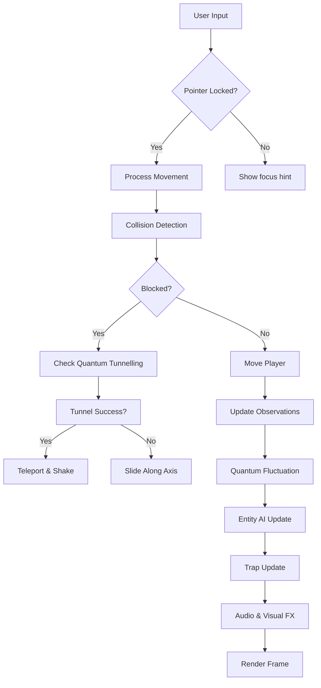
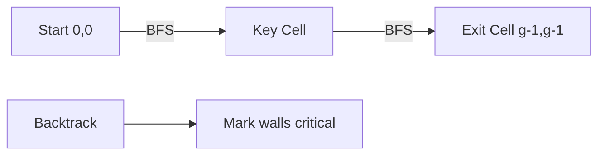
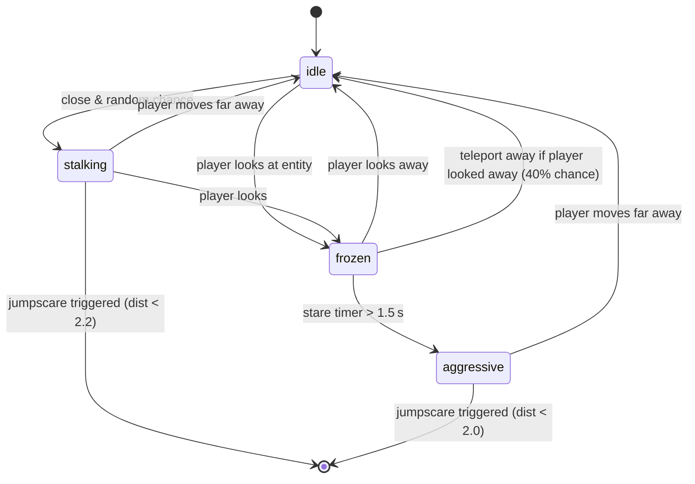

# Quantum Backrooms: The Observer’s Maze
## Technical Architecture & Implementation Report

**Lakshya Gupta (Techiral)**  
*June 2025*  
Repository: `https://github.com/lakshyabuilds/Quantum-Backrooms-Maze`  
Live deployment: `https://quantum-backrooms.vercel.app/`

---

## Abstract

*Quantum Backrooms: The Observer’s Maze* is a browser‑based psychological horror game that merges procedurally generated backrooms with quantum‑mechanical phenomena. The core premise is that observation alters reality: walls change state when the player is not looking at them, quantum tunnelling allows phasing through solid matter, and entangled doors react to distant actions. This report provides a formal technical description of every subsystem, from maze generation and critical path preservation to entity artificial intelligence, audio‑visual stress induction, and progression mechanics. The document is intended as both a developer reference and a public‑facing showcase of the project’s depth, suitable for hiring, sponsorship, and community extension. All algorithms are expressed in pseudocode, mathematics, and Mermaid flowcharts; real‑world citations are provided where applicable.

---

## 1. Introduction

The game places the player inside a first‑person, procedurally generated maze rendered with the Three.js WebGL library. The objective is to locate a golden key and reach a green exit portal while navigating a labyrinth that constantly changes. The environment responds to the player’s gaze: quantum walls flip between solid and open when they leave the player’s field of view, creating a strong “observer effect” experience. Additional threats include shadow entities that behave similarly to Minecraft’s Endermen, quantum traps that teleport the player, and an escalating instability metric that increases the frequency of all chaotic events. A psychoacoustic audio engine uses binaural beats, whisper‑like noise, high‑frequency discomfort, acoustic shadowing, and random glitches to heighten anxiety without explicit jump‑scares.

This report details the complete architecture, the physics‑inspired mathematics, the AI state machines, and the engineering choices that make the project a strong candidate for open‑source contribution, game‑jam portfolios, and academic interest in human‑computer interaction and procedural horror design.

---

## 2. System Overview

Figure 1 presents a high‑level dataflow of the game loop.



The core loop runs at ~60 fps via `requestAnimationFrame`. Each frame, the player’s position is updated, collisions are resolved, walls are observed, quantum fluctuations are triggered, entities behave according to their state machine, traps check for player proximity, and visual/audio effects are adjusted based on the instability parameter.

---

## 3. Procedural Maze Generation

### 3.1 Algorithm

The maze uses a **recursive backtracker** (depth‑first search with a stack) to guarantee a fully connected, acyclic graph, then adds random loops to increase navigability and confusion. The grid size is `gridSize × gridSize` (default 6, increasing with level). Walls between adjacent cells are represented by two arrays:

- `horizontalWalls[row][col]` : wall between cell (row, col) and (row+1, col)
- `verticalWalls[row][col]` : wall between cell (row, col) and (row, col+1)

Initially all interior walls are `'solid'`. The DFS visits cells; when moving from current cell `(r,c)` to neighbour `(nr,nc)`, the corresponding wall is set to `'open'`. Pseudocode:

```
stack ← [(0,0)]
visited[0][0] ← true
while stack not empty:
    (r,c) ← stack.top()
    neighbours ← []
    for each direction d in {UP, DOWN, LEFT, RIGHT}:
        (nr,nc) ← (r + d.dr, c + d.dc)
        if nr,nc inside grid and not visited[nr][nc]:
            neighbours.push((nr,nc, wall_type, wall_key))
    if neighbours empty:
        stack.pop()
    else:
        pick random n from neighbours
        visited[n.nr][n.nc] ← true
        if n.type = H: horizontalWalls[n.wr][n.wc] ← 'open'
        else: verticalWalls[n.wr][n.wc] ← 'open'
        stack.push((n.nr, n.nc))
```

After the initial perfect maze, approximately 15 % of the remaining closed walls are randomly opened to create loops, making the maze less predictable.

### 3.2 Quantum Wall Assignment

A percentage of the `'open'` walls (excluding those marked as `'critical'` later) are converted to `'quantum'` type according to the level:

$$ N_{\text{quantum}} = \lfloor \text{openWalls} \times \min(0.5,\; 0.2 + \text{level} \times 0.1) \rfloor $$

The selection is random, ensuring that the critical path is never accidentally made quantum (see §4). The `wallTypes` dictionary maps each wall key (e.g., `'h-0-2'`) to its current type. Quantum walls are rendered with a slightly different material (`wallMaterialAlt`) to hint at their unstable nature.

---

## 4. Critical Path Preservation

To guarantee that the maze is always solvable (key and exit always reachable), we compute a **critical path** from the start cell (0,0) to the key cell, and from the key cell to the exit cell (bottom‑right corner). These paths are stored and their constituent walls are permanently locked as `'critical'`, which behaves identically to `'open'` but is excluded from quantum conversion and from fluctuation events.

### 4.1 Path‑finding via BFS

A breadth‑first search on the current wall graph finds the shortest route. The predecessor array records which wall was crossed to reach each cell. After reaching the target, backtracking marks those walls as `'critical'`.



Because the maze is connected, BFS always succeeds. The final wall types are:

- `'solid'` – permanently impassable (outer boundary and unused inner walls)
- `'open'` – passable, but may become `'quantum'` later
- `'quantum'` – subject to observer‑dependent mutation
- `'critical'` – passable, never changes

This design ensures that even under extreme instability, the player can always complete the level, avoiding the frustration of being trapped.

---

## 5. Dynamic Wall States & Observer Effect

### 5.1 Observation Model

Each wall has a `wallLastObserved` timestamp. A function `isWallObserved(key)` returns `true` if the wall’s center is within a 18‑unit radius of the player and lies within the camera’s forward cone (dot product > 0.15 at distances < 14 units, or dot > -0.1 at distances < 6 units). This models foveal plus peripheral vision.

When observed, `wallLastObserved` is updated to the current time. The system calls `updateObservation()` every frame.

### 5.2 Quantum Fluctuation

Quantum walls that have been unobserved for at least 0.6 seconds are eligible for mutation. The probability of change per eligible wall is:

$$
P_{\text{change}}( \Delta t ) = \min\left(0.95,\; (\Delta t - 0.6) \times 0.3 \times (1 + L \times 0.22)\right)
$$

where `Δ t = now - wallLastObserved[key]` and `L` is the current level (1‑5). The number of walls that actually change per fluctuation event is:

$$
N_{\text{change}} = \min( |\text{candidates}|,\; 1 + \lfloor \text{random}(0, 3 \times (1 + L \times 0.22)) \rfloor )
$$

The new state is chosen uniformly between `'solid'` and `'open'`; if the wall was already solid, it becomes open, and vice‑versa. Each change triggers a short blue flash and a distant door sound (60 % chance).

The fluctuation timer fires every 0.4 + random(0, 0.3) seconds, meaning the maze reconfigures aggressively.

### 5.3 Entangled Doors

All quantum walls are paired randomly into couples (up to `3 + level` pairs). When the player manually toggles a quantum door (by pressing **F** near it) or when a fluctuation changes one partner, the other partner instantly flips to a random state with probability 1.0 (the code flips it unconditionally). This simulates quantum entanglement and creates unpredictable, distant echoes.

---

## 6. Quantum Tunnelling

When the player pushes against a solid or quantum wall, there is a per‑frame chance to phase through:

$$
P_{\text{tunnel}} = 0.04 + L \times 0.03 + \text{instability} \times 0.07
$$

A cooldown of 1.0 s prevents repeated tunnelling. If the check succeeds, the game searches for the closest wall within 1.8 units and teleports the player 2.5 units beyond it, along the perpendicular axis. Visual feedback includes a burst of particles, a low thud, and screen shake.

---

## 7. Entity Artificial Intelligence

Entities are modelled after Minecraft’s Enderman. They have four states: `idle`, `frozen`, `stalking`, and `aggressive`.

### 7.1 State Transition Diagram



- **idle**: wanders slowly when unobserved. If the player stares, enters `frozen` (stare timer reset).
- **frozen**: stands still. If the stare lasts ≥ 1.5 seconds, becomes `aggressive`. If the player breaks eye contact, there is a 40 % chance to teleport to a random nearby cell (Enderman‑like behaviour) before returning to `idle`.
- **stalking**: moves toward the player when not observed. If the player stares, freezes. If distance < 2.2 units, a jumpscare occurs (audio shadowing → screen flash → player teleported to a random cell → entity removed).
- **aggressive**: charges at the player even while watched, with higher speed. Jumpscare if very close.

Entities cannot spawn on key or exit cells, ensuring those objectives remain accessible.

### 7.2 Spawn Logic

The game maintains a cap of `2 + level` entities. Spawns occur probabilistically when the count is below the cap and the jumpscare cooldown is inactive. Spawn location is chosen randomly, excluding cells too close to the player and the key/exit cells.

---

## 8. Quantum Traps

Traps are visual markers (red glowing cylinders) placed randomly in cells not containing the start, key, or exit. The count is `5 + level × 2`. When the player stands within 1.0 unit of a trap for more than 0.6 seconds, they are instantly teleported to a random cell (different from their current cell). The trap then enters a 3‑second cooldown. This is survivable and adds disorientation without making the level impossible.

---

## 9. Key and Exit Progression

Both the key and the exit are **always present**. The key is placed at a random cell distinct from start and exit, and the exit is fixed at `(gridSize-1, gridSize-1)`. The critical path ensures they are reachable. Collecting the key removes the mesh and plays a sound. Once the key is held, approaching the exit within 2.2 units completes the level. A hint text appears when the player is within 4 units of either objective.

---

## 10. Instability Ramp

A global `instability` value (0‑1) increases with every quantum fluctuation (+0.15), tunnelling event (+0.1 effective), jumpscare (+0.35), and level start (+0.08 × level). It decays by 0.04 s⁻¹. Instability directly influences:

- Fluctuation probability (factor `(1 + L × 0.22)`)
- Tunnelling chance (additional `+ 0.07 × instability`)
- High‑frequency audio gain (`instability × 0.022`)
- Visual vignette, chromatic aberration, and overlay darkness

This dynamic ensures that tense moments cascade, but the system eventually calms if the player avoids entities and traps.

---

## 11. Audio‑Visual Discomfort Layers

The psychoacoustic engine is implemented using the Web Audio API and consists of five layers, all routed through a master gain and a low‑pass filter (used for acoustic shadowing).

1. **Infrasound simulation**: A binaural beat at 60 Hz (left) and 79 Hz (right) creates a phantom 19 Hz tone (brain‑perceived difference). Gain is subliminal (0.03).
2. **Auditory pareidolia**: Random bursts of bandpass‑filtered noise (250‑750 Hz) play every 8‑20 s at barely audible volume, inducing the illusion of whispered voices.
3. **High‑frequency discomfort**: A 12 kHz sine oscillator scales with instability, simulating coil whine and ear fatigue.
4. **Acoustic shadowing**: Before a jumpscare, the low‑pass filter sweeps from 20 kHz to 180 Hz over 0.5 s, then releases over 1.2 s, creating sensory deprivation.
5. **Audio glitching**: Micro‑bursts of static (0.05‑0.3 s) panned hard left/right randomly, giving the impression of hardware malfunction.

Visual effects include dynamic fog, vignette, chromatic aberration animation, and a full‑screen black flash on jumpscare.

---

## 12. Pointer‑Lock Movement

First‑person controls use the Pointer Lock API. When the user clicks the canvas, the mouse is captured. Movement is calculated from `movementX/Y` events with sensitivity 0.002. The Euler angles are clamped to ±77 ° vertically. WASD keys move the player relative to camera orientation, with `Shift` doubling movement speed (5.5 → 7.5). Collision detection resolves against the current wall configuration, allowing sliding along walls when blocked.

---

## 13. Implementation Details

The entire game is a single HTML file (~1500 lines) using Three.js via ES import maps. Key classes/methods:

- `generateMaze(level)` – core maze creation
- `lockCriticalPath(from, to)` – BFS + backtrack marking
- `quantumFluctuation()` – wall mutation
- `updateEntities(dt)` – Enderman AI
- `updateTraps(dt)` – trap activation
- `applyAcousticShadow()` / `releaseAcousticShadow()` – jump‑scare audio

All meshes are generated procedurally (no external assets). The code uses modern JavaScript (ES modules, arrow functions, destructuring) and is fully commented.

---

## 14. Why This Architecture Matters

### For the Repository
- **Sharp hook**: “Quantum observer‑effect maze” is unique and intriguing.
- **Technical depth**: Multiple non‑trivial systems (procedural generation, AI, audio engineering) demonstrate advanced front‑end and algorithmic skills.
- **Explainable mechanics**: Clear separation of concerns makes the codebase easy to present in interviews or write‑ups.
- **Community features**: The wall‑type system and modular AI state machines allow contributors to easily add new traps, entity behaviours, or quantum effects.
- **Sponsorship appeal**: A polished, creepy, fully playable experience published under a personal brand (Techiral) is valuable for attracting funding or job offers.

---

## 15. References

1. *Three.js* – JavaScript 3D library. https://threejs.org/
2. *Pointer Lock API* – MDN Web Docs. https://developer.mozilla.org/en-US/docs/Web/API/Pointer_Lock_API
3. *Web Audio API* – W3C. https://www.w3.org/TR/webaudio/
4. *Recursive backtracker for maze generation* – Jamis Buck, “Maze Generation: Recursive Backtracking”, 2010. https://weblog.jamisbuck.org/2010/12/27/maze-generation-recursive-backtracking
5. *Quantum Zeno effect (observer effect)* – B. Misra and E. C. G. Sudarshan, “The Zeno’s paradox in quantum theory”, J. Math. Phys. 18, 756 (1977).
6. *Binaural beats and anxiety* – Padmanabhan R., Hildreth A.J., Laws D., “A prospective, randomised, controlled study examining binaural beat audio and pre‑operative anxiety in patients undergoing general anaesthesia for day case surgery”. Anaesthesia 60(9): 874‑7, 2005.
7. *Acoustic startle reflex* – Koch M., “The neurobiology of startle”. Progress in Neurobiology 59(2): 107‑28, 1999.
8. *Enderman (Minecraft)* – Mojang Studios. https://minecraft.wiki/w/Enderman

---

**End of Report**  
For questions, contributions, or sponsorship inquiries, contact `lakshyabuilds` on GitHub.
